# Architecture diagrams

This directory hosts the plugin-side architecture diagram set at small scale,
mirroring the terminal-docs glossary-driven model: one inventory plus text
sources plus vector exports.

- Canonical inventory: [glossary.yaml](glossary.yaml) — every node, edge,
  shape, level, status, and source. No diagram may invent nodes not defined
  in the glossary.
- Text sources: `00-overview.mmd`, `01-lifecycle.mmd`, `02-registry.mmd` —
  Mermaid flowcharts generated into the SVG exports below.
- Vector exports: `00-overview.svg`, `01-lifecycle.svg`, `02-registry.svg` —
  maintained exports synchronized with the glossary.
- Levels: L0 overview, L1 subsystem, L2 flow.

Status rule: each node carries `accepted`, `draft`, or candidate status from
its source document. Accepted contracts win over proposals; draft content
authorizes no shipped behavior.

## Source restriction

Built only from
[research 053/054 plugin conclusions](../research-053-054-plugin-conclusions.md)
(CTX-0029) plus the plugin-platform RFC and the other accepted and draft RFCs
in this corpus. Every node traces to code or an accepted or draft RFC; no
invented nodes. Research-derived nodes stay `draft` until an owning contract
accepts them.

## Diagram inventory

| ID             | Title                               | Level | Source             | Description                                             |
| -------------- | ----------------------------------- | ----- | ------------------ | ------------------------------------------------------- |
| `00-overview`  | Plugin-side overview and boundaries | L0    | `00-overview.mmd`  | Plugin, host, Terminal Truth, registry, SDK, Panel edge |
| `01-lifecycle` | Plugin and package lifecycle        | L1+L2 | `01-lifecycle.mmd` | Manifest, grant, VM, six-state package flow, store      |
| `02-registry`  | Registry, SDK, and Panel boundary   | L1    | `02-registry.mmd`  | Entries, index, client verify, SDK path, provider gate  |







## Node provenance

| Diagram        | Node                 | Status   | Traces to                                                                 |
| -------------- | -------------------- | -------- | ------------------------------------------------------------------------- |
| `00-overview`  | Plugin               | accepted | [Plugin Platform RFC](../../specifications/plugin-platform-rfc.md)        |
| `00-overview`  | Extension Host       | accepted | [Plugin Platform RFC](../../specifications/plugin-platform-rfc.md)        |
| `00-overview`  | Terminal Truth       | accepted | [Plugin system](../../extensibility/plugin-system.md)                     |
| `00-overview`  | Registry             | accepted | [Package Follow-up RFC](../../specifications/package-followup-rfc.md)     |
| `00-overview`  | SDK and Template     | accepted | [Split Decision](../../product/bundled-plugin-split-decision.md)          |
| `00-overview`  | Panel Boundary       | draft    | [UI Extensibility](../../specifications/ui-extensibility-architecture.md) |
| `01-lifecycle` | bitty-plugin.toml    | accepted | [Plugin Platform RFC](../../specifications/plugin-platform-rfc.md)        |
| `01-lifecycle` | Capability Grant     | accepted | [Plugin Platform RFC](../../specifications/plugin-platform-rfc.md)        |
| `01-lifecycle` | Lua VM               | accepted | [Lua Runtime RFC](../../specifications/lua-runtime-rfc.md)                |
| `01-lifecycle` | Discovered..Retained | accepted | [Package Lifecycle RFC](../../specifications/package-lifecycle-rfc.md)    |
| `01-lifecycle` | Integrity Chain      | accepted | [Package Lifecycle RFC](../../specifications/package-lifecycle-rfc.md)    |
| `01-lifecycle` | Publisher Trust      | accepted | [Package Lifecycle RFC](../../specifications/package-lifecycle-rfc.md)    |
| `01-lifecycle` | Declared..Disposed   | accepted | [Plugin Platform RFC](../../specifications/plugin-platform-rfc.md)        |
| `01-lifecycle` | Generation           | accepted | [Plugin Platform RFC](../../specifications/plugin-platform-rfc.md)        |
| `01-lifecycle` | Event Pipeline       | accepted | [Plugin Platform RFC](../../specifications/plugin-platform-rfc.md)        |
| `01-lifecycle` | Plugin Store         | accepted | [Host Runtime RFC](../../specifications/plugin-host-runtime-rfc.md)       |
| `01-lifecycle` | bitty safe           | accepted | [Plugin Platform RFC](../../specifications/plugin-platform-rfc.md)        |
| `02-registry`  | Official Entry       | accepted | [Onboarding](../../product/official-plugin-onboarding.md)                 |
| `02-registry`  | Community Entry      | accepted | [Onboarding](../../product/official-plugin-onboarding.md)                 |
| `02-registry`  | Index Snapshot       | accepted | [Package Follow-up RFC](../../specifications/package-followup-rfc.md)     |
| `02-registry`  | Client Verify        | accepted | [Package Follow-up RFC](../../specifications/package-followup-rfc.md)     |
| `02-registry`  | Key Directory        | accepted | [Package Follow-up RFC](../../specifications/package-followup-rfc.md)     |
| `02-registry`  | Source Classes       | accepted | [Package Follow-up RFC](../../specifications/package-followup-rfc.md)     |
| `02-registry`  | Resolver             | accepted | [Package Follow-up RFC](../../specifications/package-followup-rfc.md)     |
| `02-registry`  | Lockfile             | accepted | [Package Lifecycle RFC](../../specifications/package-lifecycle-rfc.md)    |
| `02-registry`  | Template..Mock Host  | accepted | [Split Decision](../../product/bundled-plugin-split-decision.md)          |
| `02-registry`  | Panel Container      | accepted | [Split Decision](../../product/bundled-plugin-split-decision.md)          |
| `02-registry`  | Panel Provider       | draft    | [UI Extensibility](../../specifications/ui-extensibility-architecture.md) |
| `02-registry`  | Presentation Modes   | draft    | [Ecosystem Model](../../specifications/plugin-ecosystem-model.md)         |
| `02-registry`  | Declarative Slots    | accepted | [API v1 Surface](../../specifications/plugin-api-v1-lua-surface-rfc.md)   |

Provider-ecology nodes (`Service Registry`, `Provider Ecology`, `Lua Is
Glue`, `Self-Contained Artifact`) live in the glossary as draft
research direction from
[research 053/054](../research-053-054-plugin-conclusions.md) and the
[draft reuse RFC](../../specifications/plugin-reuse-and-providers.md); no
diagram renders them until an owning contract accepts them.

## Panel-provider boundary

The set records the boundary exactly as the corpus decides it: the generic
Panel container and Event Bus contract is accepted
([Split Decision](../../product/bundled-plugin-split-decision.md)), while the
plugin-facing registration and mount surface (`PanelProvider` registration,
Panel-to-View placement, `panel.*` capability mapping) stays draft behind
`RFC-OQ-2`, `RFC-OQ-3`, and `RFC-OQ-5`
([UI Extensibility](../../specifications/ui-extensibility-architecture.md)).
Dashed edges mark that gate; nothing here invents a `register_panel` entry
point.

## Maintenance

When a diagram changes, update the `.mmd` source and the glossary in the same
change, regenerate with `mmdc`, then run `just svg` to confirm every
committed SVG is well-formed XML:

```text
mmdc -t neutral -i docs/architecture/00-overview.mmd -o docs/architecture/00-overview.svg
just svg
```
