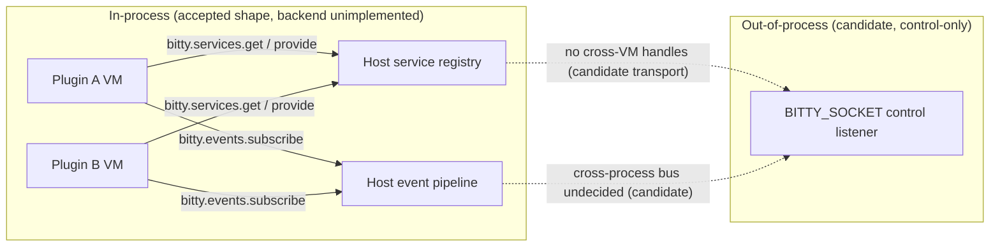

# Cross-Plugin Composition (Candidate)

> Status: **draft candidate** — not **Accepted**, not **Implemented**, not
> **Verified**, and not normative. This page records candidate direction for
> how plugins collaborate without sharing a VM. It authorizes no shipped,
> stable, or compatibility-guaranteed behavior, weakens no accepted source it
> cites, and makes no implementation claim. Every spelling repeated here is
> direction quoted from its owning contract, not a second definition.

## Purpose and scope

Plugins run in isolated Lua VMs, yet real workflows need collaboration: a
statusline wants the current Git branch, a dashboard wants agent status, and
a history plugin wants to hand command results to an AI assistant. This page
freezes the recorded direction for that collaboration so future design work
starts from one input: host-mediated composition through versioned services
and observation events, under the isolation rules that keep one plugin from
reaching into another.

In scope (all **Candidate** unless cited otherwise):

- C-1: the candidate three-layer extension model and its disclaimers.
- C-2: the services v1 surface with exact spellings and its
  not-implemented limit on the default host.
- C-3: the events v1 surface: subscribe-only, the closed name set, and
  init-time capture.
- C-4: the manifest `[services.provided]` declaration in both accepted
  forms, and `[dependencies]` as the place where service dependencies
  live.
- C-5: the isolation rules for composition.
- C-6: the local control socket versus a cross-process plugin transport.
- C-7: the accepted-versus-candidate-versus-unimplemented status map.

Out of scope and owned elsewhere (pointers, not content):

- the capability identifier grammar and grant lifecycle (accepted,
  [Plugin Platform RFC](../specifications/plugin-platform-rfc.md#capability-model-oq-012-part-2));
- the manifest schema authority (accepted,
  [Plugin Manifest and Capability Grammar Authority](../specifications/manifest-capability-authority.md));
- the event pipeline classes, budgets, and drop policy (accepted,
  [Plugin Platform RFC](../specifications/plugin-platform-rfc.md#event-pipeline-oq-013));
- the host bridge, marshalling, and timeout contracts (accepted,
  [Plugin Host Runtime RFC](../runtime/plugin-host-runtime-rfc.md));
- the out-of-process boundary itself (candidate,
  [Plugin IPC Boundary](../architecture/plugin-ipc-boundary.md));
- provider ecology beyond the minimal v1 contract: pickers, status,
  context providers, and side-by-side versions (post-1.0, draft,
  [Plugin Reuse and Provider Ecology RFC](../packaging/plugin-reuse-and-providers.md)).

## Normative sources this specification must not weaken

- [Plugin Platform RFC](../specifications/plugin-platform-rfc.md): the
  accepted `bitty-plugin.toml` schema, the capability grammar with
  deny-by-default and no wildcards, the v1 host namespaces, the trust
  boundary for service calls (callee runs with its own grants,
  schema-validated arguments, values rather than handles), and the event
  pipeline with its three classes and four v1 interception points.
- [Plugin API v1 Lua Surface RFC](../sdk/plugin-api-v1-lua-surface-rfc.md):
  the accepted Lua spellings, the closed v1 event name set, the
  subscribe-only event model, the services consumer/provider contract, and
  the explicit exclusion of cross-plugin `require`.
- [Plugin system](plugin-system.md): Lua decides policy and composition
  while Rust enforces capability and mechanism; a plugin may load its own
  modules but never another plugin's private module tree.
- [Plugin IPC Boundary](../architecture/plugin-ipc-boundary.md): the
  candidate three-layer framing and the candidate local/remote service
  proxies, each with its own disclaimer; nothing there is accepted
  contract.
- [Plugin Manifest and Capability Grammar Authority](../specifications/manifest-capability-authority.md):
  the closed capability grammar and the accepted manifest field set.
- The shared
  [security overview](https://github.com/bitty-terminal/bitty-docs/blob/main/docs/security/overview.md)
  and
  [threat model](https://github.com/bitty-terminal/bitty-docs/blob/main/docs/security/threat-model.md)
  (plugins are untrusted until a narrow capability grants access; no
  ambient authority flows through composition).

## Terminology

| Term                  | Meaning                                                                                                                               |
| --------------------- | ------------------------------------------------------------------------------------------------------------------------------------- |
| Provider              | A plugin that declares an interface name, a concrete version, and bounded JSON Schema in its manifest and offers functions for it.    |
| Consumer              | A plugin that resolves an interface by name plus a version requirement and calls it through the host.                                 |
| Interface             | A named service contract (for example `markdown.render`) with a version and argument/result schemas.                                  |
| Generation            | The monotonic instance counter per plugin ID; every runtime resource, including service handles, is owned by one generation.          |
| Locality transparency | The candidate goal that one interface spelling works whether the provider is local, in another process, or Rust-backed; not accepted. |
| Control socket        | The local `BITTY_SOCKET` listener that controls a running instance; owned outside this corpus, never a plugin transport in v1.        |

## Candidate three-layer extension model

Status: **candidate design input, twice disclaimed — not an accepted
architecture.**

The [Plugin IPC Boundary](../architecture/plugin-ipc-boundary.md#candidate-three-layer-extension-model)
proposes three layers: Core plus a Lua plugin API plus an IPC API, with one
capability layer above exposing Lua, socket, and CLI frontends. The owning
page disclaims the framing at both ends: the page as a whole is not an
accepted contract, an RFC, or an implementation claim
([status note](../architecture/plugin-ipc-boundary.md#plugin-ipc-boundary)),
and the three-layer section itself closes by restating that the combined
framing is candidate design input, not an accepted architecture. This page
repeats the model on those terms only: a way to talk about where
composition could run, never a promise that all three layers exist.

What is usable today sits entirely in the first layer: in-process services
and events between isolated Lua VMs, mediated by the host. The
out-of-process side — an external process participating as a plugin over
the socket boundary — is candidate direction with open supervision,
authorization, delivery, and addressing contracts
([open items](../architecture/plugin-ipc-boundary.md#open-points)). The
diagram below keeps that split visible: the in-process path is the
accepted-shape direction with an unimplemented backend, and everything
past the socket is labeled candidate and control-only.



## Services v1 surface

Status: **spellings accepted; backend unimplemented on the default host.**

The accepted consumer and provider spellings are
([Services](../sdk/plugin-api-v1-lua-surface-rfc.md#services)):

```lua
bitty.services.get(iface, opts) -> service | nil
bitty.services.provide(iface, impl) -> handle
```

Consumer side: `opts = { version = ">=2.0", optional? = boolean }` uses
the accepted version-requirement grammar. The provider is selected before
activation, or resolution fails closed with `E_SERVICE_RESOLUTION`
(`resolution` class); with `optional = true` a missing provider returns
`nil` instead.

Provider side: `provide` is valid during activation; `impl` is a plain
table whose members are functions. The provider declares the interface
name, the concrete version, and bounded JSON Schema
(`args_schema`/`result_schema`) in its manifest; only table-form providers
are resolvable by schema-validating consumers.

The trust boundary is accepted contract
([Plugin Platform RFC](../specifications/plugin-platform-rfc.md#plugin-api-v1-surface-oq-011)):
the callee executes with its own grants, arguments are validated against
the interface schema, and results are values, not object handles into
another plugin's VM. Provider disappearance after activation (revocation,
suspension, disable) makes in-flight calls fail closed with
`E_SERVICE_GONE` (`runtime` class); no stale handle remains callable.

The limit is stated plainly in the reference
([bitty.services Reference](../sdk/reference/services.md)): the default
host has no service backend wired, so every call fails closed with
`E_NOT_IMPLEMENTED`, and no passing test exercises a wired backend. Do
not treat `bitty.services.get` or `bitty.services.provide` as callable
today. An illustrative consumer shape, direction only, follows the
accepted options grammar:

```lua
-- Candidate API shape only; the default host answers E_NOT_IMPLEMENTED.
local git = bitty.services.get("git.repository", { version = ">=2.0" })
```

## Events v1 surface

Status: **subscribe-only; no emit entry point in v1.**

Lua exposes exactly one function
([Events](../sdk/plugin-api-v1-lua-surface-rfc.md#events),
[bitty.events Reference](../sdk/reference/events.md#signature)):

```lua
bitty.events.subscribe(name, handler) -> handle
```

`name` must be one of the closed v1 names and must be declared for the
plugin; subscribing to an undeclared type is a registration error.
`handler` is `function(event)` where
`event = { kind = string, sequence = integer, payload = table }`, and
payloads are immutable copies, never live core objects. Observation and
lifecycle handlers ignore the return value; interception handlers return
`false` to veto and anything else to approve, and rewriting content is not
expressible. There is no `bitty.events.emit` in v1: emission and delivery
are host-side, not Lua calls.

Subscription is captured at init time only: calls are valid while the
plugin generation is activating, and any subscription attempt after
`init.lua` returns is a registration error. At most 256 captured
subscriptions apply per activation, and kinds are bounded to 128 bytes.

The closed v1 name set is exactly 17 entries — 4 lifecycle, 9
observation, and 4 interception:

| Kind                         | Class        |
| ---------------------------- | ------------ |
| `plugin.activated`           | Lifecycle    |
| `plugin.suspended`           | Lifecycle    |
| `plugin.disposed`            | Lifecycle    |
| `handler.violation`          | Lifecycle    |
| `terminal.opened`            | Observation  |
| `terminal.closed`            | Observation  |
| `terminal.title-changed`     | Observation  |
| `terminal.cwd-changed`       | Observation  |
| `terminal.bell`              | Observation  |
| `focus.changed`              | Observation  |
| `selection.changed`          | Observation  |
| `process.exited`             | Observation  |
| `config.reloaded`            | Observation  |
| `intercept.command-dispatch` | Interception |
| `intercept.terminal-spawn`   | Interception |
| `intercept.paste`            | Interception |
| `intercept.open-url`         | Interception |

No byte-received, cell-changed, damage, or glyph-rendered hot-path name
exists in v1. Coalescing, queue bounds, drop policy, batching, and failure
policy belong to the accepted event pipeline and are not restated here.

## Manifest declarations

Status: **accepted schema; quoted, not redefined.**

The manifest file name is `bitty-plugin.toml`, parsed and validated
before any plugin code runs. A provider declares what it offers under
`[services.provided]`, in either accepted form
([Accepted manifest schema](../specifications/plugin-platform-rfc.md#manifest-and-identity-oq-012-part-1)):

```toml
[services.provided]
"markdown.render" = "1.0"
# Table form (ADR 0009); required for schema-validating consumers:
# "markdown.render" = { version = "1.0", args_schema = {...}, result_schema = {...} }
```

A service dependency is declared in `[dependencies]` with a version
requirement, in string or inline-table form:

```toml
[dependencies]
"xuepoo.gitcore" = ">=2.0"
# Inline-table form (ADR 0009 convention); opt one edge into prereleases:
# "xuepoo.gitcore" = { version = ">=2.0", prerelease = true }
```

Every `[lazy].events` entry must be one of the closed v1 event names
that `bitty.events.subscribe` accepts; an unknown event kind is a
validation error, never a forward-compatible extension. Resolution
evaluates the full graph before activation: cycles are rejected,
incompatible constraints are resolver errors, and lazy plugins reserve
their declared commands, subscriptions, claims, and service provisions
during graph construction so conflicts never appear first at event time.

## Isolation rules for composition

Status: **accepted direction.**

- One VM per plugin identity and generation, with no shared globals or
  module trees. A direct local-function-call shortcut must never be
  imported literally: local v1 calls stay within bounded copied
  arguments and results, non-reentrant bridge calls, and capability
  checks before effects.
- Lua decides policy and composition; Rust enforces capability and
  mechanism. Plugins choose what should happen and compose
  host-provided services; the host decides whether it may happen and how
  it is bounded.
- A plugin may load its own modules but never another plugin's private
  module tree. There is no cross-plugin `require`
  ([Not in Plugin API v1](../sdk/plugin-api-v1-lua-surface-rfc.md#not-in-plugin-api-v1)).
- Collaboration goes through versioned services or other host-mediated
  registries, never through shared references, live handles, or ambient
  authority. Authority follows the requesting plugin, never the calling
  context: a service call cannot launder a grant the caller lacks, and a
  high-risk identifier cannot be granted implicitly through workspace
  configuration or service indirection.
- Locality transparency is a candidate interface-design goal, not a
  route that exists: the consumer would use one interface while the host
  selects a local plugin, another process, or a Rust-backed provider.
  The direction recommends async-first semantics for services that may
  cross IPC so a remote operation never masquerades as an immediate
  blocking call; the `await`, `then_`, coroutine, and streaming-loop
  sketches are unaccepted pseudocode, not executable examples, and the
  accepted local synchronous contract stands unchanged.

## Local control socket versus plugin transport

Status: **control socket accepted and owned elsewhere; plugin transport
candidate.**

The `BITTY_SOCKET` listener, the Unix-socket/Windows-pipe surface, and
the bounded frame belong to the local control channel owned by the
separate `bitty-ipc` repository, which the host consumes as a pinned
revision dependency. Accepted baseline: instance discovery and selection
over that channel, where socket paths and instance identifiers stay
advisory and never credentials. Multi-instance socket layout and any
`bitty://`-style address grammar are candidate illustrations, not an
accepted grammar.

That channel is not a cross-process plugin transport in v1. Reaching an
external plugin process over it still needs the candidate contracts
tracked as open items on the owning page: plugin-process lifecycle and
supervision (launch, restart, disable, log surfacing, reconnection, crash
containment), the capability-token mapping onto accepted IPC scopes and
per-plugin grants without a parallel permission system, and cross-process
event-bus semantics (subscription authorization, delivery guarantees,
backpressure, interaction with the accepted pipeline budgets). Until
those are decided in their owning contracts, out-of-process composition
stays a proposal and authorizes no manifest field, no Lua entry point,
and no ambient IPC listener.

## Accepted versus candidate versus unimplemented

| Statement                                                        | Standing                                                     |
| ---------------------------------------------------------------- | ------------------------------------------------------------ |
| Host-mediated composition via services and events                | Accepted direction                                           |
| `bitty.services.get` / `provide` spellings and options grammar   | Accepted spelling, backend unimplemented on the default host |
| Service trust boundary (own grants, validated args, values)      | Accepted contract                                            |
| `[services.provided]` both forms; `[dependencies]` for consumers | Accepted schema                                              |
| `bitty.events.subscribe` spelling and 17-entry closed set        | Accepted spelling                                            |
| Subscribe-only model; no `bitty.events.emit` in v1               | Accepted contract                                            |
| Init-time subscription capture                                   | Accepted contract                                            |
| No cross-plugin `require`; no private-module loading             | Accepted direction                                           |
| Three-layer extension model                                      | Candidate, twice disclaimed                                  |
| Locality-transparent service proxies with async-first semantics  | Candidate proposal; sketches are unaccepted pseudocode       |
| Cross-process plugin transport over the control socket           | Candidate; needs supervision, token, and bus contracts       |
| Provider ecology (pickers, side-by-side versions)                | Deferred post-1.0                                            |

## Security review

Composition must not become a confused-deputy path. The controls that
prevent that are accepted elsewhere and are repeated here only as
constraints on this direction: deny-by-default grants with no wildcards;
the five high-risk identifiers with distinct consent that no service
call and no workspace configuration can grant implicitly; generation
disposal that releases handles so no stale generation stays callable;
bounded, redaction-aware, immutable event payloads that never carry live
core objects; interception limited to veto-or-approve on four cold-path
points with fail-open timeouts; revocation that detaches handlers at the
next dispatch boundary; and update gating so added capabilities block
automatic update pending permission-diff approval. A service requirement
grants neither an IPC connection nor network access. The candidate
transport layers add no ambient IPC and no default network listener.

## Verification plan

Acceptance of this direction as contract later requires, at minimum:

1. A per-section source check: every repeated spelling, bound, and name
   still matches its owning accepted document at the cited section, and
   any drift is reconciled there first.
2. Service conformance tests per the accepted verification plan:
   duplicate and unknown-identifier rejection, pre-activation
   resolution failure, optional-`nil` return, schema-violation refusal,
   generation-disposal completeness, and `E_SERVICE_GONE` on provider
   disappearance.
3. Negative capability tests: composition grants nothing by itself;
   revocation takes effect at the next dispatch boundary; high-risk
   identifiers stay unreachable through service indirection or
   workspace configuration.
4. Event-pipeline property tests from the accepted plan: queue bounds
   never exceeded, producers never blocked, coalescing correctness,
   drop accounting accuracy, fail-open interception under injected
   hangs, and veto-wins determinism.
5. Removal of the not-implemented limit only with implementation
   evidence in the owning repository plus the manifest-hash grant and
   fuzz coverage the accepted manifest rules require.

## Alternatives considered

| Option                                            | Trade-offs                                                                                                                                                       | Verdict                                            |
| ------------------------------------------------- | ---------------------------------------------------------------------------------------------------------------------------------------------------------------- | -------------------------------------------------- |
| Direct cross-plugin `require`                     | Zero host overhead, but shared references break VM isolation, generation disposal, and grant attribution; failures stop being attributable to one owner.         | Rejected; excluded from v1.                        |
| Plugin-side event emission                        | Lets plugins drive each other directly, but bypasses declaration checks, bounded queues, and drop accounting; bursts become one plugin's weapon against another. | Excluded; v1 is subscribe-only with host delivery. |
| Synchronous location-transparent calls everywhere | One spelling with no async surface to learn, but a remote operation can masquerade as an immediate call and block the UI thread behind an unbounded wait.        | Rejected; async-first candidate stands.            |
| Out-of-process plugin transport now               | Unlocks other languages and crash isolation sooner, but supervisor, token-mapping, and bus contracts are undecided and no manifest or Lua surface names them.    | Candidate; needs its owning contracts first.       |
| Minimal kernel: commands plus observation only    | Smallest review surface, but statusline-class consumers cannot ship without services, so the first composition wave would fork private patterns.                 | Rejected for v1 per the accepted surface options.  |

## Affected contracts

| Theme                               | Existing document                                                                                      | Relationship                                                 |
| ----------------------------------- | ------------------------------------------------------------------------------------------------------ | ------------------------------------------------------------ |
| Service and event spellings         | [Plugin API v1 Lua Surface RFC](../sdk/plugin-api-v1-lua-surface-rfc.md)                               | Quotes; redefines nothing.                                   |
| Manifest schema and trust boundary  | [Plugin Platform RFC](../specifications/plugin-platform-rfc.md)                                        | Quotes the accepted schema and service rules.                |
| Manifest field authority            | [Plugin Manifest and Capability Grammar Authority](../specifications/manifest-capability-authority.md) | Defers; adds no field.                                       |
| Three-layer framing and proxies     | [Plugin IPC Boundary](../architecture/plugin-ipc-boundary.md)                                          | Repeats the candidate with both disclaimers intact.          |
| Isolation and composition policy    | [Plugin system](plugin-system.md)                                                                      | Specializes the mechanism/policy split for composition.      |
| Service backend status              | [bitty.services Reference](../sdk/reference/services.md)                                               | Repeats the not-implemented limit.                           |
| Subscription capture and closed set | [bitty.events Reference](../sdk/reference/events.md)                                                   | Repeats the subscribe-only and init-time rules.              |
| Provider ecology beyond v1          | [Plugin Reuse and Provider Ecology RFC](../packaging/plugin-reuse-and-providers.md)                    | Defers; this page freezes nothing past the minimal contract. |

## Open points

1. When does a service backend land on the default host, and what
   conformance evidence retires the `E_NOT_IMPLEMENTED` limit?
2. What is the supported service-version model: one provider version,
   multiple side-by-side versions, or interface-specific policy?
3. What are the versioned proxy and adapter contracts mapping the public
   schema to each admitted transport, including serialization, payload
   budgets, typed errors, and provider identity and generation?
4. What are the async completion, cancellation, streaming, backpressure,
   and provider-loss semantics before any locality-transparent route is
   adopted?
5. What are the cross-process event-bus semantics: subscription
   authorization, delivery guarantees, backpressure, and interaction
   with the accepted pipeline budgets?
6. Who supervises an out-of-process plugin: launch, restart, disable,
   log surfacing, reconnection, and crash containment?
7. How does a capability token map onto accepted IPC scopes and
   per-plugin grants without creating a parallel permission system?
8. Is any `bitty://`-style multi-instance addressing grammar adopted,
   and how does it relate to accepted instance selection?

## Acceptance criteria

1. Every body section carries a status label, and no sentence presents
   candidate or prototype material as shipped behavior.
2. Every repeated spelling, bound, and event name matches its owning
   accepted document at the cited section.
3. The three-layer model and the proxy direction keep both disclaimers,
   and the diagram labels the out-of-process side candidate and
   control-only.
4. The services not-implemented limit and the subscribe-only event model
   are stated without softening.
5. No rejected manifest field is cited, and no new manifest field,
   capability, Lua entry point, or wire contract is introduced.
6. `just check` passes with zero issues.

## P0 Review Sign-off

- [ ] Category owner: composition direction, status labels, and source
      fidelity reviewed.
- [ ] Docs curator: taxonomy, metadata, terminology, links, and
      navigation reviewed.
- [ ] Security reviewer: trust boundary, isolation rules, and
      confused-deputy constraints reviewed.
- [ ] Owning implementation repositories supply backend evidence before
      any unimplemented statement is upgraded.

## References

- [Plugin Platform RFC](../specifications/plugin-platform-rfc.md)
  (Accepted; manifest schema, capability model, v1 surface, event
  pipeline.)
- [Plugin API v1 Lua Surface RFC](../sdk/plugin-api-v1-lua-surface-rfc.md)
  (Accepted; services and events spellings, closed name set,
  exclusions.)
- [Plugin IPC Boundary](../architecture/plugin-ipc-boundary.md) (Draft
  candidate; three-layer model, service proxies, open items.)
- [Plugin system](plugin-system.md) (Draft; mechanism/policy split,
  isolation, composition direction.)
- [Plugin Manifest and Capability Grammar Authority](../specifications/manifest-capability-authority.md)
  (Accepted; manifest and capability field authority.)
- [bitty.services Reference](../sdk/reference/services.md) (Draft;
  not-implemented status and denial shape.)
- [bitty.events Reference](../sdk/reference/events.md) (Draft;
  subscribe-only capture model and closed set.)
- [Plugin Host Runtime RFC](../runtime/plugin-host-runtime-rfc.md)
  (Accepted; bridge, marshalling, and budget contracts.)
- [Plugin Reuse and Provider Ecology RFC](../packaging/plugin-reuse-and-providers.md)
  (Draft; deferred provider ecology.)
